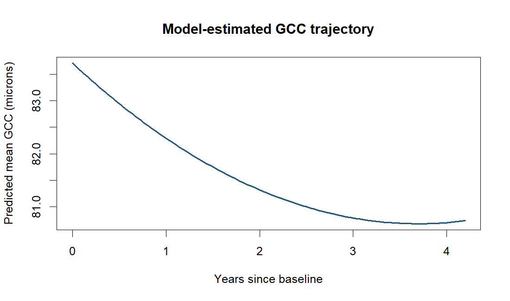

# Longitudinal Retinal Thickness in Glaucoma

Compare time trends and within-person correlation structures for retinal ganglion cell complex thickness.

**Author:** Heyang Ma · Independent UCLA graduate course project, revised for this portfolio.
**Tools:** R / nlme, Nonlinear trajectories, Residual correlation. **Scope:** 107 subjects · 786 visits.

## Question and result

How does GCC thickness change during follow-up, and which covariance structure describes repeated measurements?

A quadratic mean trajectory was preferred among the tested mean structures by BIC. With that fixed mean, random intercepts and slopes plus continuous-time AR(1) residuals had the lowest BIC (4078.6). The fitted time terms were −1.634 × time + 0.221 × time².



## What the analysis does

The executable analysis is [analysis.R](analysis.R). [Methods and interpretation](REPORT.md) explains the scope; [revision notes](REVISION_NOTES.md) distinguish the original analysis from the portfolio revision.

## Run locally

Use R 4.5.2; the recommended package `nlme` is required.
Read [data access and input requirements](DATA_ACCESS.md), then run from this repository:

```sh
Rscript analysis.R data/ADAP_Macula_GCC_dataset.csv results
```

## Results and limits

Model comparisons are exploratory; intervals omit model-selection uncertainty. Baseline severity groups can show regression to the mean even when the baseline visit is removed from follow-up modeling. The fitted curve should not be extrapolated beyond observed follow-up or interpreted as a treatment effect.

The committed `results/` files are generated summaries from the portfolio revision. Source records, credentials, fitted models, and original notebook outputs are excluded.

